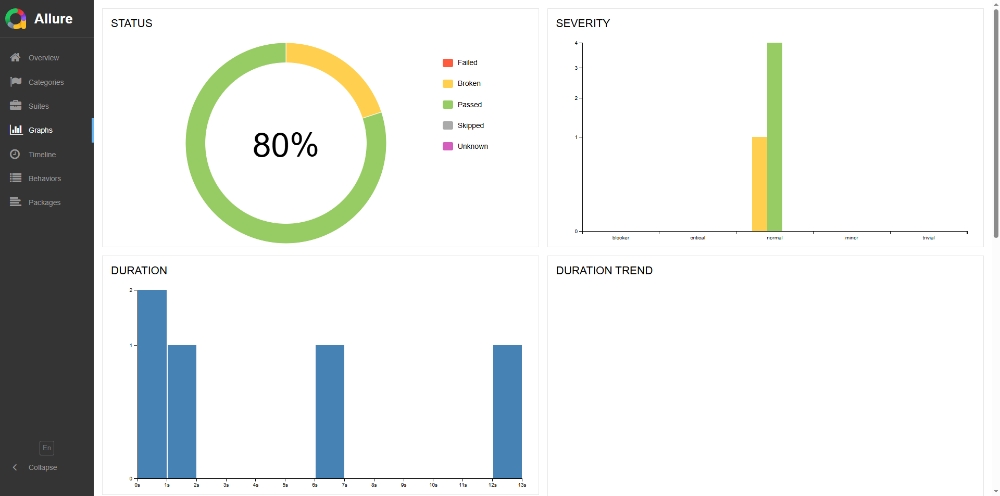
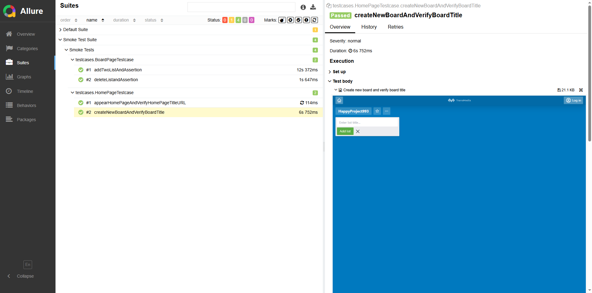

# My Boards Automation

## Overview
This is an automated testing framework for the My Boards Panel web application, built using Selenium with Java. The framework implements the Page Object Model (POM) design pattern and uses TestNG for test execution.

## Technology Stack
- Java 21
- Maven 3.5.2
- TestNG 7.9.0
- Selenium Java 4.32.0
- Selenium DevTool v137 4.33.0
- Web Driver 6.1.0
- Maven Surefire Plugin 3.5.2
- Allure Reports 2.29.0
- AspectJ 1.9.24

## Prerequisites
- Java Development Kit (JDK) 21
- Maven
- Clone the repository to your local machine  ( https://github.com/transmediainc/qa-automation-home-assignment)


## Project Structure
```
trans-media-my-boards/
├── src/
│   ├── main/
│   │   (empty or not shown)
│   │
│   └── test/
│       └── java/
│           ├── pages/               # Page Object classes
│           ├── testcases/           # Test case classes
│           │   ├── BoardPageTestcase.java
│           │   └── HomePageTestcase.java
│           └── utilities/           # Helper classes
│
│       └── resources/               # Resource files (images for reports)
│           ├── Overview.png
│           └── Testdetails.png
│
├── target/                          # Maven build output
│
├── .gitignore                       # Git ignore rules
├── pom.xml                          # Maven configuration
├── README.md                        # Project documentation
├── RegressionTestSuite.xml          # TestNG regression suite
└── SmokeTestSuite.xml               # TestNG smoke suite


```

## Test Categories

### Smoke Tests
- Basic functionality verification


### Regression Tests
- Comprehensive testing


## Features Tested

1. **Home Page**
    - Appear home page and url verification
    - Create new board functionality

2. **BoardPage**
    - Create new List functionality
    - List Deletion functionality
   
## Setup Instructions

### 1. Environment Setup
- Install JDK 21
- Install Maven 3.5.0+
### 2. Project Setup
```
```bash
# Clone repository
git clone <repository-url>
   cd trans-media-my-boards

# Install dependencies
mvn clean install
```

## Running Tests

### All Tests

```bash
   mvn clean test
```

### Smoke Tests Only

```bash
Linux : mvn clean test Dsurefire.suiteXmlFiles=SmokeTestSuite.xml -Dgroups=smoke
Windows (Headless) : mvn clean test "-Dsurefire.suiteXmlFiles=SmokeTestSuite.xml" "-Dgroups=smoke" -Dbrowser=chrome -Dmode=headless
Windows (Headed) : mvn clean test "-Dsurefire.suiteXmlFiles=SmokeTestSuite.xml" "-Dgroups=smoke" -Dbrowser=chrome -Dmode=headed

```

### Regression Tests Only

```bash
Linux : mvn clean test Dsurefire.suiteXmlFiles=RegressionTestSuite.xml -Dgroups=regression
Windows (Headless) : mvn clean test "-Dsurefire.suiteXmlFiles=RegressionTestSuite.xml" "-Dgroups=regression" -Dbrowser=chrome -Dmode=headless
Windows (Headed) : mvn clean test "-Dsurefire.suiteXmlFiles=RegressionTestSuite.xml" "-Dgroups=regression" -Dbrowser=chrome -Dmode=headed

```

## Test Reports

### Allure Reports

```bash
# Generate report
allure generate --clean -o allure-report

# Open report
allure open allure-report
```

#### Sample Report View





## Framework Features
- Page Object Model implementation
- Fluent wait mechanisms
- Screenshot capture on failure
- Reusable components
- Custom utilities
- Parallel execution support
- Group-based test execution
- Allure reporting integration

## Best Practices
- Modular test structure
- Proper exception handling
- Clear naming conventions
- Consistent coding standards
- Regular cleanup mechanisms
- Efficient element locators
- Proper timeout management
- Detailed test documentation

## Troubleshooting

1. **Changes in any locators may result as test failure**
2. **Automation may fail due slow network.**


## Contributing

```bash
1. Fork the repository
2. Create feature branch
3. Commit changes
4. Push to branch
5. Create pull request
```

## Version History
- `v0.0.1-SNAPSHOT`: Initial framework setup

## License
© 2025 **A M Kabbo Hossain** - [SQA Engineer]. All rights reserved.
